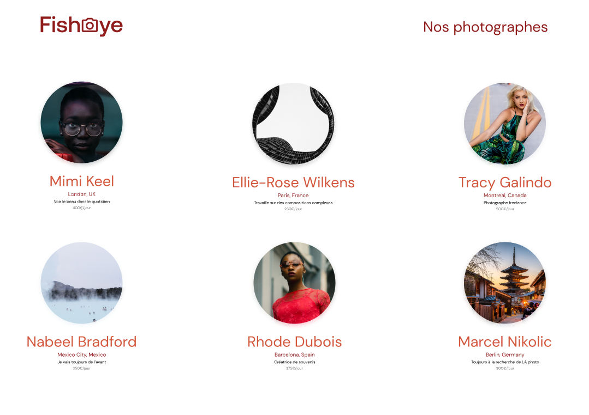

 

  

  <h3 align="center">FishEye</h3>

  

    FishEye est un site web qui permet aux photographes indépendants de présenter leurs meilleurs travaux.
     
    <a href="https://laury-thiallier.github.io/LauryTHIALLIER_6_16122021/"><strong>ALLER SUR LE SITE</strong></a>
  

## À PROPOS DU PROJET :

### VERSION DESKTOP :
  

    
  

### LANGAGES / LIBRAIRIES / FONTS
* [HTML](https://github.com/Laury-THIALLIER/LauryTHIALLIER_6_16122021/search?l=html)
* [CSS](https://github.com/Laury-THIALLIER/LauryTHIALLIER_6_16122021/search?l=CSS)
* [JavaScript](https://github.com/Laury-THIALLIER/LauryTHIALLIER_6_16122021/search?l=javascript)

## PROJET FISHEYE

### SCÉNARIO :

Depuis quelques semaines, vous êtes développeur junior chez Techasite, une société de conseil spécialisée dans le développement de sites web et d'applications mobiles. Avec votre cheffe de projet Amanda et le Designer UI, vous venez de faire une réunion de lancement du projet avec un nouveau client, FishEye.

## MES OUTILS

#### ÉDITEUR DE CODE : [Visual Studio Code](https://code.visualstudio.com/)
#### NAVIGATEURS : [Brave](https://brave.com/fr/) / [Firefox Developer Edition](https://www.mozilla.org/fr/firefox/developer/)
#### OS : [Windows 10 Pro](https://www.microsoft.com/fr-fr/p/windows-10-pro/df77x4d43rkt?rtc=1&activetab=pivot:overviewtab)